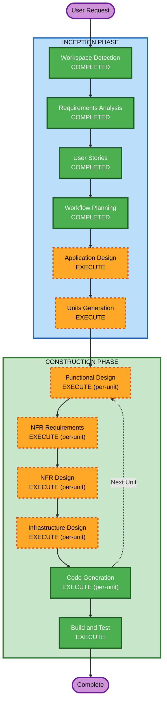

# Execution Plan — TaskFlow

## Detailed Analysis Summary

### Change Impact Assessment
- **User-facing changes**: Yes — full web application with auth, task management, dashboard, team pages
- **Structural changes**: Yes — greenfield monorepo with API and Web apps
- **Data model changes**: Yes — 3 new entities (User, Task, Comment) with PostgreSQL
- **API changes**: Yes — 15+ new REST endpoints under /api/v1/
- **NFR impact**: Yes — security (JWT, RBAC, SECURITY-01 to 15), performance (<200ms), logging (structlog)

### Risk Assessment
- **Risk Level**: Medium — greenfield reduces risk (no existing code to break), but full-stack complexity and security requirements add risk
- **Rollback Complexity**: Easy — greenfield, no production dependencies
- **Testing Complexity**: Complex — backend API tests, frontend component tests, auth flows, RBAC

## Workflow Visualization



### Text Alternative
```
INCEPTION PHASE:
- Workspace Detection ............ COMPLETED
- Requirements Analysis .......... COMPLETED
- User Stories ................... COMPLETED
- Workflow Planning .............. COMPLETED
- Reverse Engineering ............ SKIPPED (greenfield)
- Application Design ............. EXECUTE
- Units Generation ............... EXECUTE

CONSTRUCTION PHASE (per-unit loop):
- Functional Design .............. EXECUTE
- NFR Requirements ............... EXECUTE
- NFR Design ..................... EXECUTE
- Infrastructure Design .......... EXECUTE
- Code Generation ................ EXECUTE (always)
- Build and Test ................. EXECUTE (always)

OPERATIONS PHASE:
- Operations ..................... PLACEHOLDER
```

## Phases to Execute

### INCEPTION PHASE
- [x] Workspace Detection (COMPLETED)
- [x] Reverse Engineering (SKIPPED — greenfield project)
- [x] Requirements Analysis (COMPLETED)
- [x] User Stories (COMPLETED)
- [x] Workflow Planning (COMPLETED)
- [ ] Application Design — EXECUTE
  - **Rationale**: New components, services, and models needed. Must define API layer structure, service layer, frontend component architecture, and inter-layer dependencies.
- [ ] Units Generation — EXECUTE
  - **Rationale**: Complex system with backend API, frontend Web, and shared infrastructure. Needs decomposition into manageable units of work with clear dependencies.

### CONSTRUCTION PHASE (per-unit)
- [ ] Functional Design — EXECUTE
  - **Rationale**: New data models (User, Task, Comment), complex business logic (task lifecycle, assignment rules, authorization), and API contracts need detailed design.
- [ ] NFR Requirements — EXECUTE
  - **Rationale**: Security rules SECURITY-01 to SECURITY-15 enforced. Performance (<200ms), rate limiting, JWT auth, structured logging, password hashing all require NFR specification.
- [ ] NFR Design — EXECUTE
  - **Rationale**: NFR patterns must be incorporated: middleware for auth/rate limiting, security headers, structured logging configuration, CORS setup.
- [ ] Infrastructure Design — EXECUTE
  - **Rationale**: Docker Compose for local dev, GCP Cloud Run + Cloud SQL for staging, CI/CD with GitHub Actions all need infrastructure design.
- [ ] Code Generation — EXECUTE (ALWAYS)
  - **Rationale**: Full implementation of backend API, frontend, Docker, CI/CD.
- [ ] Build and Test — EXECUTE (ALWAYS)
  - **Rationale**: Build instructions, test execution, validation of all components.

### OPERATIONS PHASE
- [ ] Operations — PLACEHOLDER

## Stages Skipped
- **Reverse Engineering** — Greenfield project, no existing code to analyze

## Success Criteria
- **Primary Goal**: Working TaskFlow Phase 1 application (API + Frontend) running on Docker Compose
- **Key Deliverables**:
  - FastAPI backend with all 15+ endpoints
  - React frontend with 6 pages (Login, Register, Dashboard, Kanban, Task List/Detail, Team)
  - PostgreSQL schema with Alembic migrations
  - Docker Compose setup for local development
  - GitHub Actions CI pipeline
  - GCP deployment configuration (Cloud Run + Cloud SQL)
- **Quality Gates**:
  - Backend test coverage >= 80%
  - All SECURITY rules compliant
  - API response < 200ms for paginated endpoints
  - All linting passes (ruff, eslint, prettier)
